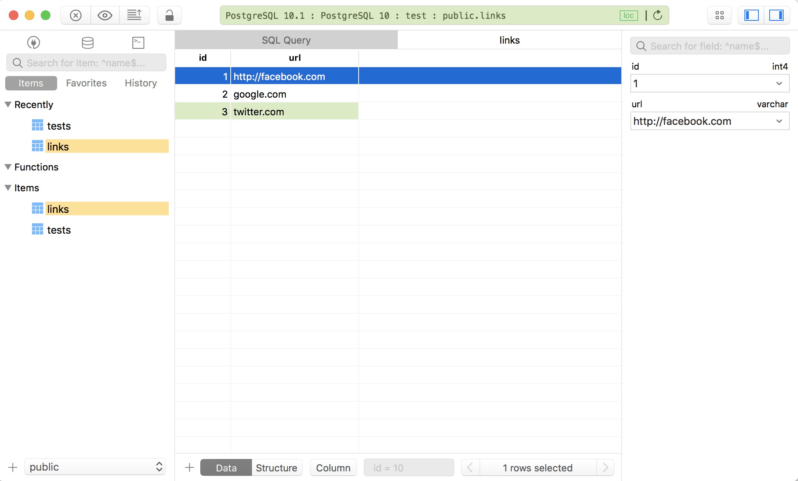

# Walkthrough - Upgrading your toolset

[Back to Challenge](../08_upgrading_your_toolset.md)

It's hard to get a good picture of a database just using `psql`. That's why several programs offer a Graphical User Interface ('GUI') to databases.

One such tool is [TablePlus](https://tableplus.io/).

> You will need to be on macOS High Sierra (as a minimum) to use TablePlus.

## Installing TablePlus

To install the program:

- Download TablePlus.
- Drag the TablePlus app into your `/Applications` directory.
- Double-click to start it.

## Connect TablePlus to your PostgreSQL database management system

TablePlus needs to know some details about your Postgres server. In particular, it needs to know:

- Where it is;
- What login details are required;
- What database it should start with.

We have answers for all three:

- `localhost` (i.e. your PostgreSQL server is running 'backgrounded' on your local machine, on Port 5432)
- Your computer's name as a username (or, you can find this out by listing databases in `psql`), and no password
- The `bookmark_manager` database.

## Playing with TablePlus

- You can execute SQL via the little 'Terminal' icon.
- You can switch databases via the little 'database' icon.

> Generally, I'll keep a tool like TablePlus open when working on a web app that uses a database. It helps to keep an eye on what's going on at the most important level – the data level.

[Next Challenge](../09_setting_up_a_testing_environment.md)
