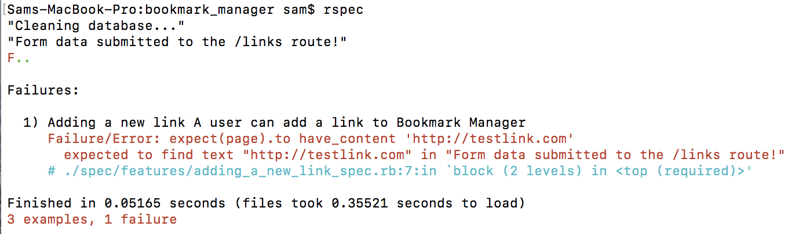

# Walkthrough – Creating bookmarks

[Back to Challenge](../10_creating_bookmarks.md)

In this walkthrough, I'll show you how I'd:

- Create a User Story from the requirement
- Write a feature test for the User Story
- Solve the feature test by following a TDD cycle.
- Refactor the solution into the Bookmark model.
- Test in the development environment.

> If you prefer to work directly with a code diff, [here's](https://github.com/soph-g/bookmark-manager-example/commit/7d63eebf3ad593b071376beae11a9b4e09e70060) a commit for this stage.

## Creating the User Story

The requirement is:

* Add new bookmarks :construction:

A User Story for this could be:

```
As a user
So I can store bookmark data for later retrieval
I want to add a bookmark to Bookmark Manager
```

> Yours can be different to this. User Stories are a thinking tool, not a 'right/wrong' sort of thing.

## Write a feature test for adding bookmarks

Let's add a feature test for the user:

- Visiting a page, `/bookmarks/new`
- Typing a URL into a form on that page
- Submitting the form
- Seeing the bookmark they just submitted.

> I find it helpful to think out the user's actions in a bullet-point list like the one above, before writing my Capybara test. You might want to try drawing the interaction, or using a process flow diagram - whatever works for you!

In Capybara-speak, these actions look like this:

```ruby
# in spec/features/creating_bookmarks_spec.rb

feature 'Adding a new bookmark' do
  scenario 'A user can add a bookmark to Bookmark Manager' do
    visit('/bookmarks/new')
    fill_in('url', with: 'http://testbookmark.com')
    click_button('Submit')

    expect(page).to have_content 'http://testbookmark.com'
  end
end
```

## Solving the feature test

**I run my test.** It fails:

```
Failures:

  1) Adding a new bookmark A user can add a bookmark to Bookmark Manager
     Failure/Error: fill_in('url', with: 'http://testbookmark.com')

     Capybara::ElementNotFound:
       Unable to find visible field "url" that is not disabled
```

We need to create a Sinatra route in `app.rb`:

```ruby
# in app.rb

get '/bookmarks/new' do
  erb :"bookmarks/new"
end
```

**I run my test.** I have a new error: there's nothing to 'fill in' on the page. So, I'll add a form to the `views/bookmarks/new.erb` file:

```html
<!-- inside views/bookmarks/new.erb -->

<form>
  <input type="text" name="url" />
</form>
```

> I've given the `<input>` tag a `name` attribute of `url`. Right now, this is so Capybara knows how to find it.

**I run my test.** Now I have a new failure:

```
Failures:

  1) Adding a new bookmark A user can add a bookmark to Bookmark Manager
     Failure/Error: click_button('Submit')

     Capybara::ElementNotFound:
       Unable to find visible button "Submit"
```

I have no 'Submit' button. Easily solvable:

```html
<!-- inside views/bookmarks/new.erb -->

<form>
  <input type="text" name="url" />
  <input type="submit" value="Submit" />
</form>
```

**I run my test.** It fails:

```
Failures:

  1) Adding a new bookmark A user can add a bookmark to Bookmark Manager
     Failure/Error: expect(page).to have_content 'http://testbookmark.com'
       expected to find text "http://testbookmark.com" in ""
```

It looks like my bookmark isn't showing up on the page. Here's what's happening at the moment:

- The user visits the `/bookmarks/new` route and `GET`s an HTML page containing a form from the Sinatra application.
- The user fills out the form and submits.
- Submitting a form defaults to sending a `GET` request to the current URL: `/bookmarks/new`.

In other words: right now, submitting the form just fetches a new form from the Sinatra application.

We need the form data to submit to a different route in Sinatra. In that route, we'll try to save the form data to the database in some way.

We should use a `POST` route to define this route, as we're submitting data to the application to be saved.

Let's update the form:

```html
<form action="/bookmarks" method="post">
  <input type="text" name="url" />
  <input type="submit" value="Submit" />
</form>
```

**I run my test.** As expected, the form submits to a non-existent Sinatra route:

```
Failures:

  1) Adding a new bookmark A user can add a bookmark to Bookmark Manager
     Failure/Error: expect(page).to have_content 'http://testbookmark.com'
       expected to find text "http://testbookmark.com" in "Sinatra doesn’t know this ditty. Try this: # in app.rb class BookmarkManager post '/bookmarks' do \"Hello World\" end end"
```

Let's define this `POST` route, and print to the console whenever the route is activated:

```ruby
# in app.rb

get '/bookmarks/new' do
  erb :"bookmarks/new"
end

post '/bookmarks' do
  p "Form data submitted to the /bookmarks route!"
end
```

**I run my test.** In my logs, I can see that the form submits to the `/bookmarks` route:



We can now flesh out the route, saving the submitted data to the database:

```ruby
# in app.rb

get '/bookmarks/new' do
  erb :"/bookmarks/new"
end

post '/bookmarks' do
  url = params['url']
  connection = PG.connect(dbname: 'bookmark_manager_test')
  connection.exec("INSERT INTO bookmarks (url) VALUES('#{url}')")
  redirect '/bookmarks'
end
```

Take the time to understand the code above. In it, we:

- Get the `url` from the submitted form data (`params`).
- Connect to the test database.
- Execute the SQL to insert a new bookmark to the database, with a url value of the url submitted by the user.
- Redirect to the homepage (which shows all bookmarks, thanks to the `get '/bookmarks'` route defined in `app.rb`).

**I run my test.** It passes.

> I really do run my tests this much!

## Refactoring

At the moment, our `POST` route connects to the database and executes SQL: all in the controller. **This is directly against the idea of MVC.** If we leave it, it'll give future developers licence to write weird, confusing code. Any database interaction should happen in the model.

Just like we did with `.all`, let's imagine a better interface for the `POST` action of our controller. How about:

```ruby
post '/bookmarks' do
  Bookmark.create(url: params['url'])
  redirect '/bookmarks'
end
```

This interface is attractive. Let's write a test for it:

```ruby
# in spec/bookmark_spec.rb

describe '.create' do
  it 'creates a new bookmark' do
    Bookmark.create(url: 'http://www.testbookmark.com')

    expect(Bookmark.all).to include 'http://www.testbookmark.com'
  end
end
```

Let's solve our failing test by moving logic from the controller into the model:

```ruby
# in lib/bookmark.rb

def self.create(url:)
  if ENV['ENVIRONMENT'] == 'test'
    connection = pg.connect(dbname: 'bookmark_manager_test')
  else
    connection = pg.connect(dbname: 'bookmark_manager')
  end

  connection.exec("INSERT INTO bookmarks (url) VALUES('#{url}')")
end
```

This passes our unit test. We can now use the nicer interface in the controller:

```ruby
post '/bookmarks' do
  Bookmark.create(url: params['url'])
  redirect '/bookmarks'
end
```

Our `rspec` tests all pass.

## Testing in the development environment

It's always a good idea to double-check that a feature which works in the test environment also works in the development environment. Try out adding some new bookmarks and see what happens in TablePlus and the `/bookmarks` page.

## Refactoring dummy data insertion

We have a test that inserts dummy data into the database  `features/viewing_bookmarks_spec.rb`. Now that we have a nicer way of inserting data into the database, we can refactor it:

```diff
# in spec/features/viewing_bookmarks_spec.rb

   scenario 'Visiting /bookmarks shows me all the bookmarks' do
-    connection = PG.connect(dbname: 'bookmark_manager_test')
-
     # Add the test data
-    connection.exec("INSERT INTO bookmarks (url) VALUES ('http://www.makersacademy.com');")
-    connection.exec("INSERT INTO bookmarks (url) VALUES('http://www.destroyallsoftware.com');")
-    connection.exec("INSERT INTO bookmarks (url) VALUES('http://www.google.com');")
+    Bookmark.create(url: "http://www.makersacademy.com")
+    Bookmark.create(url: "http://www.destroyallsoftware.com")
+    Bookmark.create(url: "http://www.google.com")

visit('/bookmarks')

### the rest of the test ###
```

[Next Challenge](../11_wrapping_database_data_in_program_objects.md)
