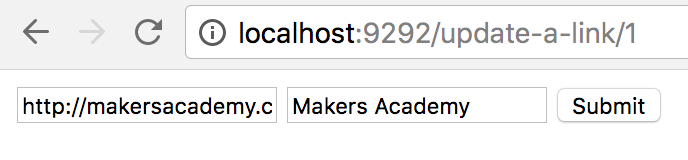

## Walkthrough – CRUD

[Back to Challenge](../14_crud.md)

**CRUD** is an acronym for the four 'basic functions' of persistent storage:

- **Creating** data
- **Reading** data
- **Updating** data
- **Deleting** data

So far, our application is a CR app. Let's make it a CRUD one.

This walkthrough is in two parts:

- Deleting Links.
- Updating Links.

> Code diffs are available for each feature separately: it's best to commit on features.

## 1. Deleting Links

> If you prefer to work from a code diff, it's [here](https://github.com/sjmog/bookmark_manager/commit/fd7134d908d082d6771e61b218b60c3a37ca62f8).

Here's our requirement:

* Delete Links

Here's a User Story for that requirement:

```
As a user
So I can remove my link from Bookmark Manager
I want to delete a link
```

Here's the user flow for deleting a link:

1. Visit the homepage.
2. Click a 'delete' button next to a link.
3. See the homepage, without that link.

Here's that flow in Capybara terms:

```ruby
# in spec/features/deleting_a_link_spec.rb

feature 'Deleting a link' do
  scenario 'A user can delete a link' do
    visit('/')

    within '#link-1' do
      click_button 'Delete'
    end

    expect(current_path).to eq '/'
    expect(page).not_to have_content 'Makers Academy'
  end
end
```

> I've used Capybara's `within` method to click the Delete button inside the element with ID 'link-1'. Take a look at the index.erb [here](https://github.com/sjmog/bookmark_manager/blob/de7b8d6a93d0edc7bed45ee9e166e57a2f16d674/views/index.erb) for how I've labelled that element.

When we run this test, it fails as expected: I haven't added the button to `index.erb` yet. Let's do that now:

```diff
<ul>
  <% @links.each do |link| %>
    <li id="link-<%= link.id %>">
      <a href="<%= link.url %>" target="_blank">
        <%= link.title %>
      </a>
+      <input type="submit" value="Delete" />
    </li>
  <% end %>
</ul>
```

Our test still fails, because this button doesn't do anything. Let's wrap it in a form:

```diff
<ul>
  <% @links.each do |link| %>
    <li id="link-<%= link.id %>">
      <a href="<%= link.url %>" target="_blank">
        <%= link.title %>
      </a>
+      <form action="/delete-link" method="post">
        <input type="submit" value="Delete" />
+      </form>
    </li>
  <% end %>
</ul>
```

> POST is the most suitable method to use here. There is no commonly-agreed DELETE method, and besides: POST is meant to be used for **any transaction that can't be repeated**. GET is for repeatable things (like fetching a webpage), and POST is for non-repeatable things (like creating an object, deleting an object, or updating an object). There are various hacks that enable more appropriate methods like PUT and DELETE, but they're all built on top of POST. Read more [here](https://softwareengineering.stackexchange.com/questions/114156/why-are-there-are-no-put-and-delete-methods-on-html-forms).

Now our form submits! But we're just linking to the 'Sinatra doesn't know this ditty' page:

```
Failures:

  1) Deleting a link A user can delete a link
     Failure/Error: expect(current_path).to eq '/'
     
       expected: "/"
            got: "/delete-link"
```

We need to build a route for our Delete button to submit to, in `app.rb`:

```ruby
# in app.rb

post '/delete-link' do
  # let's print out the form params
  p params
end
```

What do we do in this route? We'd like something like `Link.delete` to happen – but how will we know which link to delete? We need some way for our form to tell us which 'Delete' button was clicked. Notice that, when we run our test at the moment, the `params` are empty.

Let's use a **hidden input** to submit the link ID along with the POST request:

```diff
<ul>
  <% @links.each do |link| %>
    <li id="link-<%= link.id %>">
      <a href="<%= link.url %>" target="_blank">
        <%= link.title %>
      </a>
      <form action="/delete-link" method="post">
+        <input type="hidden" name="id" value="<%= link.id %>">
        <input type="submit" value="Delete" />
      </form>
    </li>
  <% end %>
</ul>
```

Now when we submit the form, `params` equals `{"id"=>"1"}`. We can use this to write the SQL to delete the link with that ID, and redirect:

```ruby
# in app.rb

post '/delete-link' do
  connection = PG.connect(dbname: 'bookmark_manager_test')
  connection.exec("DELETE FROM links WHERE id = #{params['id']}")
  redirect '/'
end
```

Now that our test passes, let's move the SQL into the `Link` model. Start with a spec for `Link.delete`:

```ruby
# in spec/link_spec.rb

describe '.delete' do
  it 'deletes a link' do
    Link.delete(1)

    links = Link.all
    urls = links.map(&:url)

    expect(urls).not_to include "http://www.makersacademy.com"
  end
end
```

And let's pass this test by moving the logic from the controller to the model:

```ruby
# in lib/link.rb

class Link
  def self.delete(id)
    connection.exec("DELETE FROM links WHERE id = #{id}")
  end

  ### rest of the class ###
end
```

Our unit test passes, so we can rewrite the controller action:

```ruby
# in app.rb

post '/delete-link' do
  Link.delete(params['id'])
  redirect '/'
end
```

All tests pass: we've delivered the feature!

## Update Links

As always, our flow is:

- Requirement
- User Story
- Feature Test
- Unit Tests
- Implementation
- Refactoring

> Prefer to read the code directly? You can check out the entire commit [here](https://github.com/sjmog/bookmark_manager/commit/5d60ae2f03d30c86060833166e51453ebf9aabf7).

Here's our requirement:

* Update Links

Here's a User Story for that requirement:

```
As a user
So I can change a link in Bookmark Manager
I want to update a link
```

Here's the user flow for deleting a link:

1. Visit the 'update link' form for a particular link.
2. Fill in the form with new data – say, a new title – and submit it.
3. See the homepage, with the updated link title (and the old one is gone).

Here's that flow in Capybara terms:

```ruby
# in spec/features/updating_a_link_spec.rb

feature 'Updating a link' do
  scenario 'A user can update a link' do
    visit('/update-a-link/1')

    fill_in('url', with: "http://www.snakersacademy.com")
    fill_in('title', with: "Snakers Academy")
    click_button('Submit')

    expect(current_path).to eq '/'
    expect(page).not_to have_content 'Makers Academy'
    expect(page).to have_content 'Snakers Academy'
  end
end
```

> I've decided to make use of Sinatra's [named parameters](http://sinatrarb.com/intro.html) for this route: so visiting `/update-a-link/1` will allow the user to update a link with an ID of 1, and so on.

Let's define a route for this form:

```ruby
# in app.rb

get '/update-a-link/:id' do
  erb :update_a_link
end
```

And a view with the form:

```html
<!-- in views/update_a_link.erb -->

<form action="/update-a-link" method="post">
  <input type="text" name="url" />
  <input type="text" name="title" />
  <input type="submit" value="Submit" />
</form>
```

And another route, to which this form submits:

```ruby
post '/update-a-link' do
  p params
  redirect('/')
end
```

Our test now fails because, although we have all the right routes and views, we're not doing anything to the database in any of them:

```
Failures:

  1) Updating a link A user can update a link
     Failure/Error: expect(page).not_to have_content 'Makers Academy'
       expected not to find text "Makers Academy" in "Makers Academy Google Facebook"
```

Working backwards, we'd like our `POST /update-a-link` route to do actually update a link. To update a link, we need the ID of the link we're trying to update. To get that, we need the link ID to be submitted by the form. To do that, we need to add a hidden field to the form containing the link ID (like we did with delete). And to do _that_, we need to supply the link ID to the form.

Let's update our `GET /update-a-link/:id` route with the link ID:

```diff
# in app.rb

get '/update-a-link/:id' do
+  @link_id = params['id']
  erb :update_a_link
end
```

Let's update the form to take that Link ID in a hidden input:

```diff
<!-- in views/update_a_link.erb -->

<form action="/update-a-link" method="post">
+  <input type="hidden" name="id" value="<%= @link_id %>">
  <input type="text" name="url" />
  <input type="text" name="title" />
  <input type="submit" value="Submit" />
</form>
```

And update the `POST /update-a-link` route with the SQL required to connect to the database, and update the apppropriate record:

```ruby
# in app.rb

post '/update-a-link' do
  connection = PG.connect(dbname: 'bookmark_manager_test')
  connection.exec("UPDATE links SET url = '#{params['url']}', title = '#{params['title']}' WHERE id = '#{params['id']}'")

  redirect('/')
end
```

Our test now passes. Time to refactor!

The first obvious refactor is to push the updating SQL into the model, spec-first:

```ruby
# in spec/link_spec.rb

describe '.update' do
  it 'updates a link' do
    Link.update(1, url: 'http://www.snakersacademy.com', title: 'Snakers Academy')

    links = Link.all
    urls = links.map(&:url)
    titles = links.map(&:title)

    expect(urls).not_to include "http://www.makersacademy.com"
    expect(titles).not_to include "Makers Academy"
    expect(urls).to include "http://www.snakersacademy.com"
    expect(titles).to include "Snakers Academy"
  end
end
```

We can solve this by moving the controller SQL into the link model:

```ruby
# in lib/links.rb

def self.update(id, options)
  DatabaseConnection.query("UPDATE links SET url = '#{options[:url]}', title = '#{options[:title]}' WHERE id = '#{id}'")
end
```

And replacing the controller SQL with the call to the Link model:

```ruby
# in app.rb

post '/update-a-link' do
  Link.update(params['id'], params)
  redirect('/')
end
```

Secondly: **wouldn't it be nice** if our 'edit' form contained the data-to-be-edited? That is: when a user visits the 'edit' form, they see the data 'as it is', and can edit it.

To do this, we need to pass more than just `@link_id` to the form. We need to pass a `Link` object that wraps the data for that link. We've got `Link.all` to pull all links from the database: we need some way of pulling one Link out. Here's how it could work in the controller:

```ruby
# in app.rb

get '/update-a-link/:id' do
  @link = Link.find(params['id'])
  erb :update_a_link
end
```

Let's write a `Link.find` method to do that.

```ruby
# in spec/link_spec.rb

describe '.find' do
  it 'finds a link' do
    link = Link.find(1)

    expect(link.url).to eq "http://www.makersacademy.com"
    expect(link.title).to eq "Makers Academy"
  end
end
```

Here's the implementation in `Link`:

```ruby
# in lib/link.rb

class Link
  def self.find(id)
    result = DatabaseConnection.query("SELECT * FROM links WHERE id = #{id}")
    result.map { |link| Link.new(link['id'], link['url'], link['title']) }.first
  end

  ### rest of the class ###
end
```

> Just like with `Link.all`, we have to use the ORM pattern to wrap the link data in a useful Ruby object.

Now we can use this `Link` object in our form. We can set the `value` attribute of each input to the current value of the `link`:

```html
<!-- in views/update-a-link.erb -->

<form action="/update-a-link" method="post">
  <input type="hidden" name="id" value="<%= @link.id %>">
  <input type="text" name="url" value="<%= @link.url %>" />
  <input type="text" name="title" value="<%= @link.title %>" />
  <input type="submit" value="Submit" />
</form>
```

Now when a user visits the form, this is what they see:



Now, when a user updates a link, it feels much more like they're 'editing the data' for that link.

[Next Challenge](../15_rest.md)
