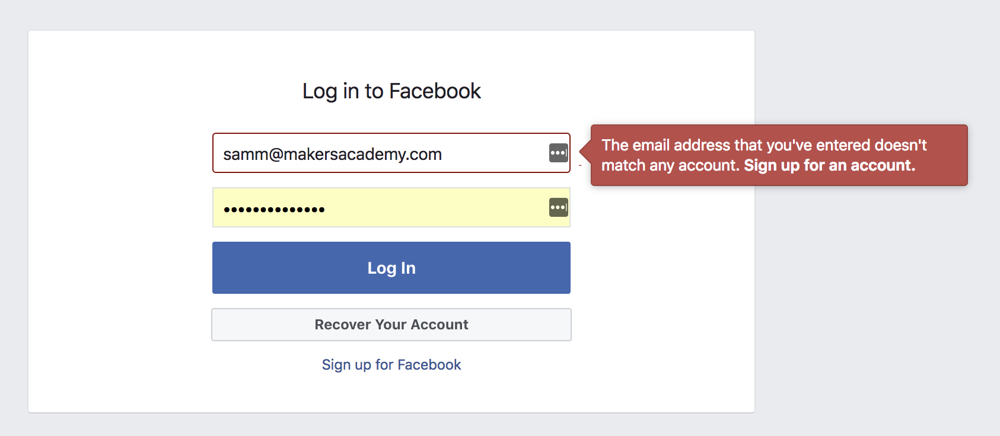

# Walkthrough – Validations

[Back to Challenge](../15_validating_bookmarks.md)

**Validations** used to force users to submit the right data into your database, and to show them an error if they didn't:



This walkthrough is in three parts:

- Adding a feature test for an invalid URL.
- Adding Sinatra-Flash to show a message, passing this test.
- Refactoring the validation logic into the `Bookmark` model.


> If you prefer to work from a code diff, there is a commit for this challenge [here](https://github.com/soph-g/bookmark-manager-example/commit/5e0400858064377258ea4177cf83591dca3247f4).

## 1. Adding a feature test for an invalid URL

Here's the user flow for submitting an invalid URL:

1. Visit the new bookmark page.
2. Submit a new bookmark with a string like 'not a bookmark'.
3. See an error message, and don't see 'not a bookmark' in the list of bookmarks.

Here's that flow in Capybara terms:

```ruby
# in spec/features/adding_a_new_bookmark_spec.rb

scenario 'The bookmark must be a valid URL' do
  visit('/bookmarks/new')
  fill_in('url', with: 'not a real bookmark')
  click_button('Submit')

  expect(page).not_to have_content "not a real bookmark"
  expect(page).to have_content "You must submit a valid URL."
end
```

When we run this test, it fails as expected.

## 2. Passing the test, and adding Sinatra-Flash

We can solve this test in the controller, using [Ruby's built-in `uri` module](https://stackoverflow.com/questions/1805761/how-to-check-if-a-url-is-valid):

```ruby
# in app.rb
require 'uri'

post '/bookmarks' do
  if params['url'] =~ /\A#{URI::regexp(['http', 'https'])}\z/
    Bookmark.create(url: params['url'], title: params[:title])
  else
    flash[:notice] = "You must submit a valid URL."
  end

  redirect('/bookmarks')
end
```

> The Flash is used to display one-time messages.

To use the `flash`, we need to add the `sinatra-flash` gem to our Gemfile, install it to our project, and include `sinatra/flash` in our controller. Then, we need to `enable :sessions`.

Instructions for doing all that are on the [Sinatra-Flash gem Github page](https://github.com/SFEley/sinatra-flash).

Once you have set up `flash` in the controller, you'll need update the `/bookmarks` view to display the message using `<%= flash[:notice] %>` in `/views/bookmarks.erb`

> The flash message is set in the `POST` `/bookmarks/new` route - so why do we need to change the `/bookmarks` page to display it?

## 3. Refactoring the validation logic into the `Bookmark` model

Our `post /bookmarks` route is looking very messy. Wouldn't it be great if `Bookmark.create` just handled validating URLs on its own?

Let's write a unit test for that:

```ruby
# in spec/bookmark_spec.rb

describe '.create' do
  it 'does not create a new bookmark if the URL is not valid' do
    Bookmark.create(url: 'not a real bookmark', title: 'not a real bookmark')
    expect(Bookmark.all).not_to include 'not a real bookmark'
  end

  ### other tests omitted for brevity ###
end
```

We can pass the test by simply moving the validation into the `Bookmark.create` method. Let's split it out to a private method, too:

```ruby
# in bookmark.rb
require 'uri'

class Bookmark
  def self.create(url:)
    return false unless is_url?(url)
    result = DatabaseConnection.query("INSERT INTO bookmarks (url, title) VALUES('#{url}', '#{title}') RETURNING id, title, url;")
    Bookmark.new(id: result[0]['id'], title: result[0]['title'], url: result[0]['url'])
  end

  ### rest of the class omitted for brevity ###

  private

  def self.is_url?(url)
    url =~ /\A#{URI::regexp(['http', 'https'])}\z/
  end
end
```

Now we can use this updated `create` method in our controller:

```ruby
# in app.rb

post '/bookmarks' do
  flash[:notice] = "You must submit a valid URL." unless Bookmark.create(url: params[:url], title: params[:title])
  redirect('/bookmarks')
end
```

Our test still passes and now we've unit-tested it, too. Great!

[Next Challenge](../16_one_to_many_relationships.md)
