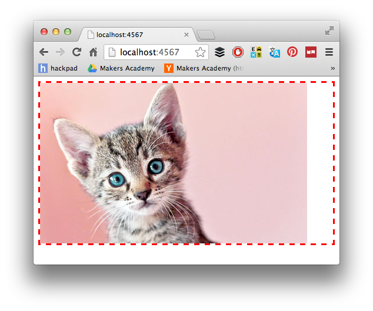

# Sinatra: Returning HTML

[Back to the Challenge Map](00_challenge_map.md)

We've created a web application that returns basic strings as responses to client requests.

Most web applications don't return basic strings: they return advanced HTML documents, along with CSS (for styling), JavaScripts (for interaction effects), and other assets (like images, videos, and audio).

In this challenge, you will substitute your basic response strings with some HTML.

### Challenge Setup

By the end of this challenge, you should see (in your browser) something like this:

### Learning Objectives covered
- Return HTML from a Sinatra route

### To complete this challenge, you will need to:

- [ ] Define a new route, called `get '/cat'`.
- [ ] Using this image: http://bit.ly/1eze8aE , return an HTML string from the route that displays a cat photograph surrounded by a red dotted border.

### Resources

- [Sinatra Main Intro Documentation](http://www.sinatrarb.com/intro.html)
- [CSS Borders (Mozilla Developer Network)](https://developer.mozilla.org/en/docs/Web/CSS/border)

### [Walkthrough](walkthroughs/08_sinatra_returning_html.md)
