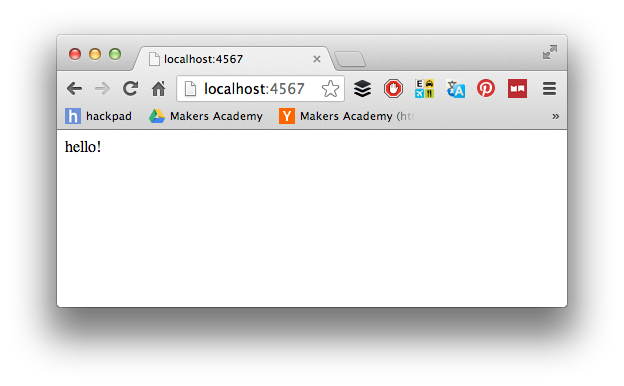

# Sinatra: Defining a route

[Back to the Challenge Map](README.md)

You have just set up a server within your local machine. At the moment, it doesn't do very much. You saw an error message something like this:

This is happening because your client - your browser - is making a request using a **path** for which your server has no **route**. When a server receives a request along with a _path_, it activates a particular _route_.

In this case, the request path is `/`. `/` usually activates a server's 'root' route, or the **index** route of an application. Some websites and some browsers 'hide' the `/` path.

> If you want to double-check this, go to `http://google.co.uk`. Now go to `http://google.co.uk/` (i.e. with the trailing slash). There's no difference: that's because the first URL simply 'hides' the trailing slash. If you see characters _after_ the slash, don't worry - these aren't necessarily part of the path.

Sinatra's error messages are very helpful. In this case, we are told what we can do to fix our error.

In this challenge, you will define a root **route** for Sinatra that responds with a string `"hello!"`.

### Challenge Setup

Here's what you should end up with:

### To complete this challenge, you will need to:

- [ ] Use Sinatra's error message above to define a route that responds to incoming requests to the `/` path
- [ ] Return the string `"hello!"` from this route
- [ ] Check that your route works by visiting your application in the browser at the correct address.

> Are you able to visit your application from a different computer? Why/why not?

### Resources

* [Sinatra Main Intro Documentation](http://www.sinatrarb.com/intro.html)

### [Walkthrough](walkthroughs/sinatra_defining_a_route.md)
