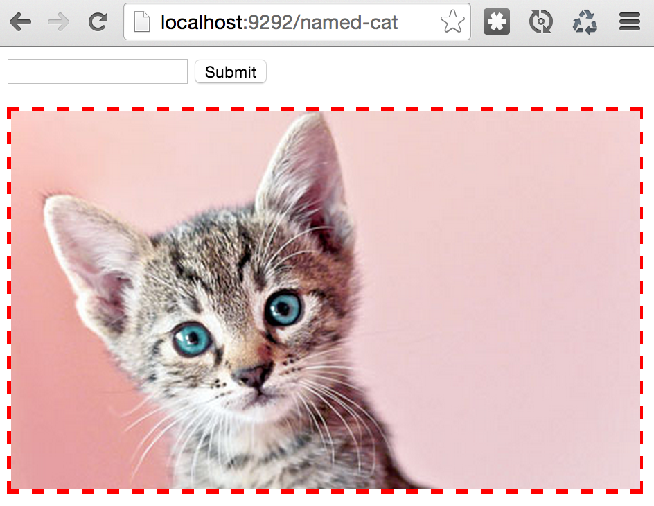
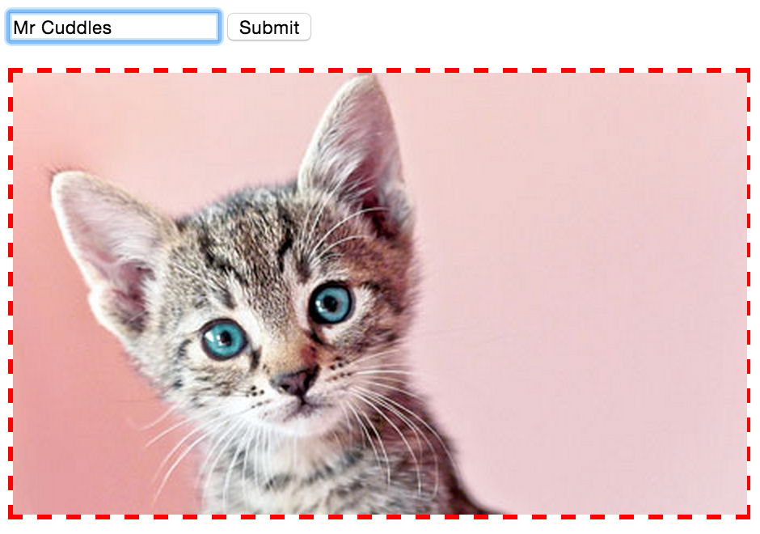
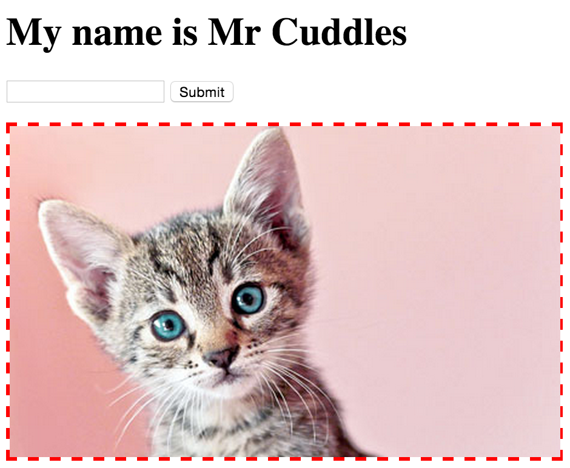

# Solution – Sinatra: using Forms

[Back to the Challenge](../03_sinatra_defining_a_route.md)

It's inconvenient to enter the cat's name directly in the URL. Let's create a form to ask for the cat's name. Modify your erb template:

```erb
<% if @name %>
<h1>My name is <%= @name %></h1>
<% end %>
<form action="/named-cat">
  <input type="text" name="name">
  <input type="submit" value="Submit">
</form>
<div style='border: 3px dashed red'>
  
</div>
```

So, we've:

- Added a `form` element to the view
- Set the form `action` to `/named-cat`
- Added text input with a `name` of `name`
- Added a submit button with a value of `Submit`

Let's try visiting the page. We should see something like this:



When we fill in the form:



...and hit 'Submit', we get:



Take a look at the query strings. It looks like submitting the form constructs the query string for us. Here's what it looks like after submitting the form:


How does this affect the `params` our server receives? Ensure you're printing your `params` to the server logs:

```ruby
get '/named-cat' do
  p params
  @name = params[:name]
  erb :index
end
```

Our params should look something like this:


So, what's happening behind the scenes?

The form tag creates a form that sends the data back to the server when it's submitted. The URL that the form data is sent to is defined by the form `action` attribute. The data that is sent is determined by the fields that are present inside the form (before the closing </form> tag).

In this case we have two "input" fields. The first one is the text input field (because it has type "text") and the second one is the submit button (because it has type "submit"). Even though they look and act differently, they are both created by the **input** tag.

Since the second input tag doesn't have any data in it (it's a button, after all), it won't be sent back to the server. But the first input tag will be. The string that you input into it will be sent back to the server as the "name" parameter because that's what we specified in the "name" attribute:

```html
<input type="text" name="name">
```

So, when you click the submit button, your browser:

1. Constructs a request to the path specified in the `action` attribute of the form tag 
2. Constructs a query string depending on the inputs within the form, and appends this to the request
3. Sends the request to the server.

Github and switch! :twisted_rightwards_arrows:

Next up, we'll hide our query parameters by using the `POST` action.

[Forward to the Challenge Map](../00_challenge_map.md)