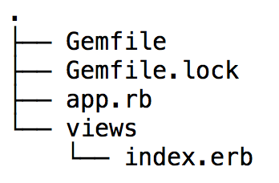

# Walkthrough – Sinatra: Views

[Back to the Challenge](../09_sinatra_views.md)

So, we've got a kitten inside a box with a red border. The code looks something like this:

````ruby
require 'sinatra'

get '/cat' do
  "<div style='border: 3px dashed red'>
     
   </div>"
end
````

It works, but you can already guess a problem: it doesn't scale. Web pages usually have hundreds, if not thousands lines of HTML and CSS code. That's on top of thousands of lines of Ruby code. Putting it all together in a single file would lead to a mess: lots of unstructured code that is very hard to maintain.

A better solution is to separate our Ruby and HTML code. Let's create a folder called **views**, located in the same directory as our `app.rb` file. Then create **views/index.erb**. Let's move the HTML code into the file we just created, so your project structure and the new file look like this:



In our `app.rb` file we'll just put this instead:

````ruby
require 'sinatra'

get '/cat' do
  erb(:index)
end
````

Assuming this all works it's a good time to commit our code, push it to Github and switch Driver/Navigator Roles again&nbsp;:twisted_rightwards_arrows: 

What's happening here? On line 4 in the `do ... end` block, we're calling `erb`, a method from the _templating system_ that ships with Ruby. We are asking it to render a file called **index.erb** from the folder **views**. 

> How does it know to look inside the folder **views**? The name of the folder is just a convention: if you don't specify any other name, `erb` will assume that you want to use the file in the **views** folder.

We just called `erb` a _templating system_. The reason is that it's actually much more powerful than it may seem on the surface. `erb` stands for Embedded Ruby. This means that the templates can combine plain text, such as HTML code, with executable Ruby code.

In the next Challenge, we'll execute Ruby code within a View.

[Forward to the Challenge Map](../README.md)
