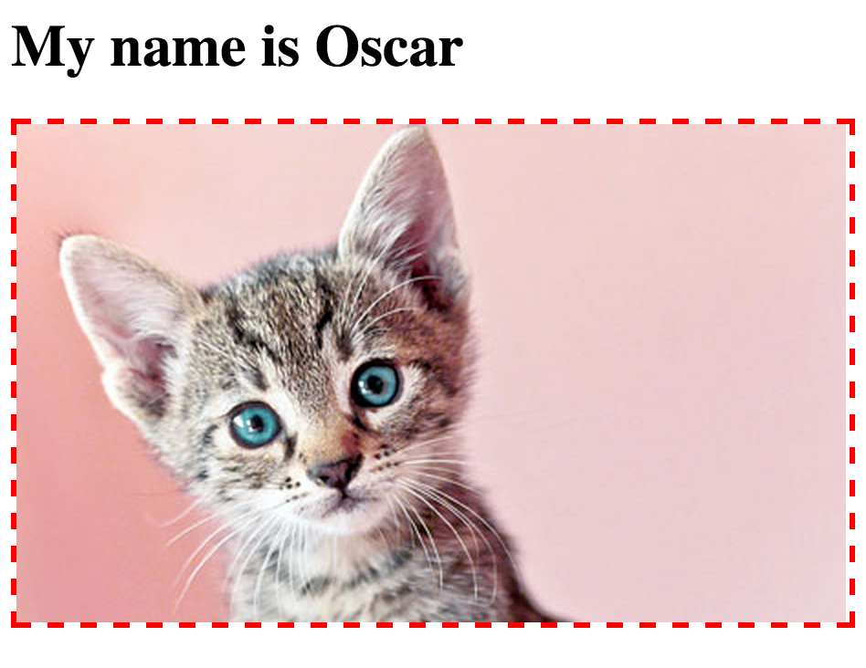

# Walkthrough – Sinatra: `erb`

[Back to the Challenge](../sinatra_erb.md)

Let's say we want to give our kitten a name. For kicks, we're going to select a random name that will change each time the page is reloaded. For now, we'll do this _within the view_.

> In the next Challenge, we will once again use the _separation of concerns_ to move this kind of logic back _out_ of the view. For now, we're doing it here by way of introduction.

First, let's add an `h1` tag, pre-filled with the 'static' content we _always_ want to see.

```erb
<h1>My name is </h1>
<div style='border: 3px dashed red'>
  
</div>
```

Now, let's add some ERB tags (`<% %>`) to print out the return value of a Ruby expression:

```erb
<h1>My name is <% %></h1>
<div style='border: 3px dashed red'>
  
</div>
```

We need to remember to include the `=` after the first tag, otherwise the expression will _evaluate_ (work itself out) but not _interpolate_ (print the return value to the page):

```erb
<h1>My name is <%= %></h1>
<div style='border: 3px dashed red'>
  
</div>
```

Now let's add an expression that samples some names from an array:

```erb
<h1>My name is <%= ["Amigo", "Oscar", "Viking"].sample %></h1>
<div style='border: 3px dashed red'>
  
</div>
```

> We could refactor the expression to use `%w(Amigo Oscar Viking)` if we were feeling snazzy.

When the page is rendered using `erb`, we should wind up with an HTML document that looks like this:

```html
<h1>My name is Oscar</h1>
<div style='border: 3px dashed red'>
  
</div>
```

And so, a page that looks like this:



So, we've just learned how to evaluate Ruby expressions within our views, using `erb`. Next up, we'll move this kind of logic in to the controller (or 'routing') layer to better separate our concerns. Naturally you'll want to commit the code, push it to Github and switch Driver/Navigator Roles &nbsp;:twisted_rightwards_arrows:.

[Forward to the Challenge Map](../README.md)


