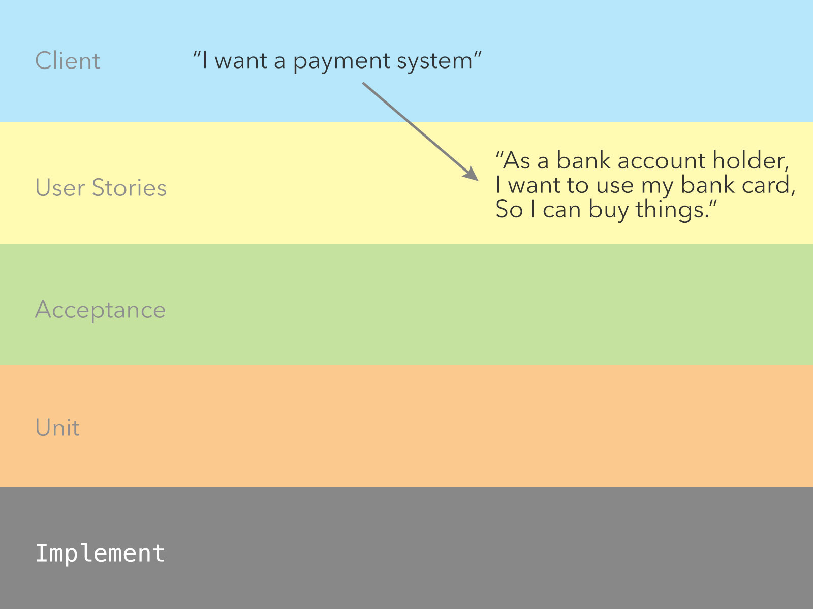
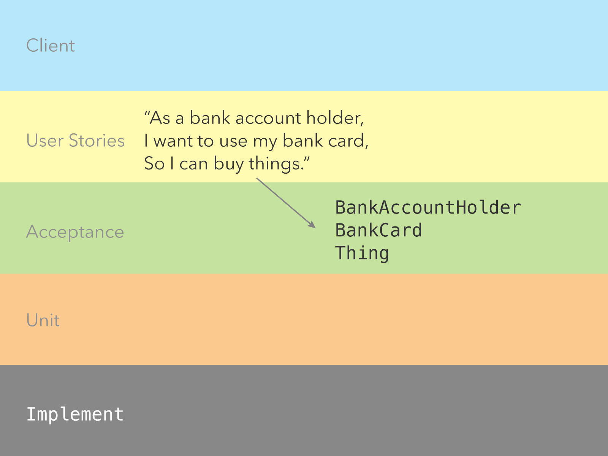
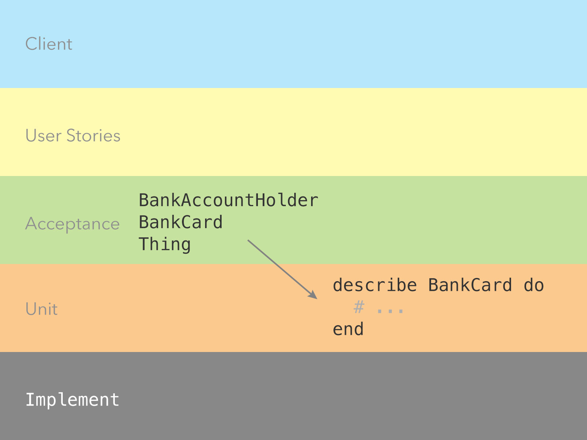
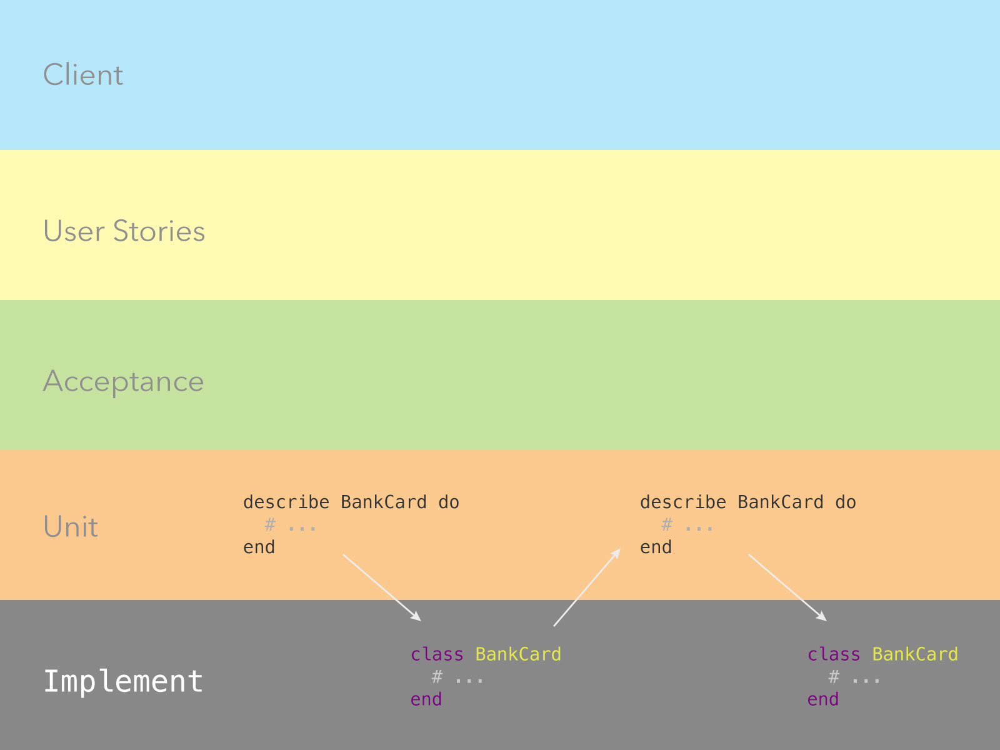
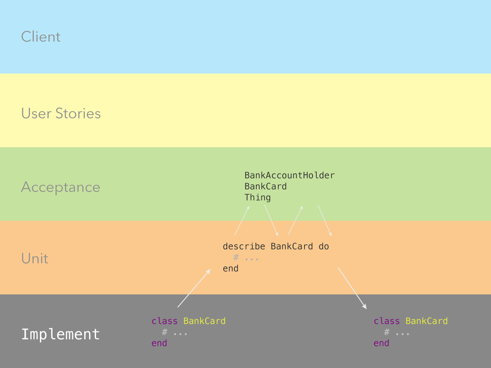
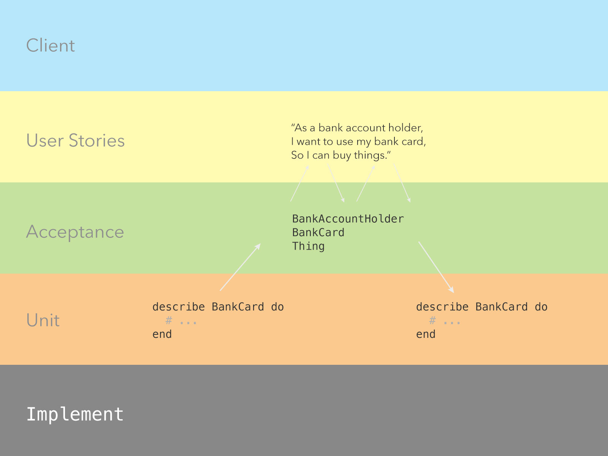
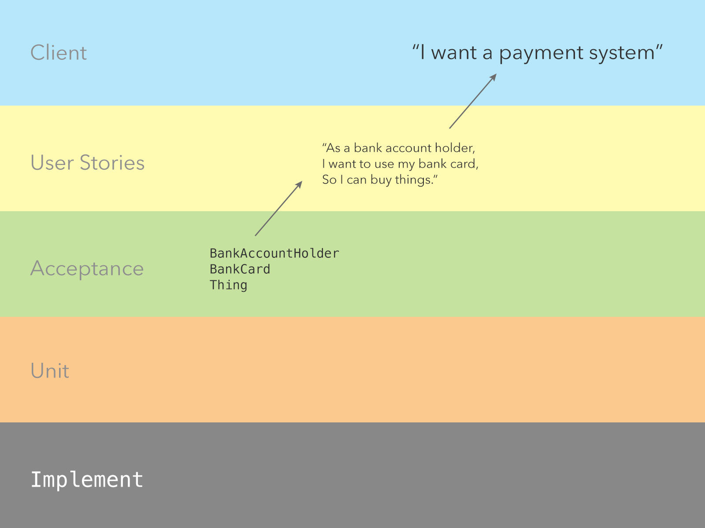
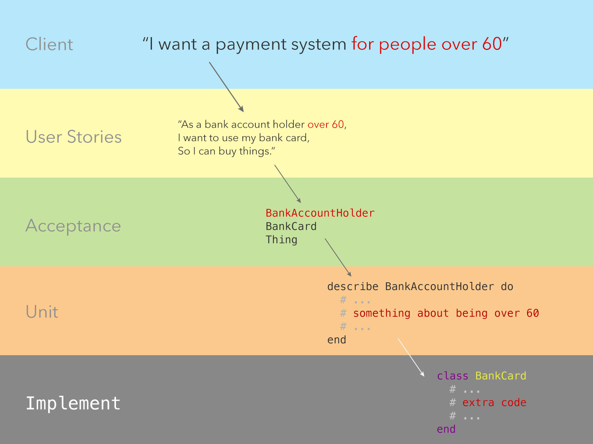

## The BDD Cycle

The BDD Cycle lives at the heart of crafting well-designed, stable applications. As a process, it:

- covers the entire development cycle, from client request to delivery of the application;
- guides developers in what to build next;
- results in applications that are easy to change later, when clients inevitably change their mind, and
- ensures the final delivery is fully-tested and highly robust.

The BDD Cycle splits application development into separate 'stages'. As a result of moving up and down between these stages, a clear **Application Design** and **Domain Model** _emerge_.

The Red - Green - Refactor process, which is intrinsic to BDD, is available as a video [here](https://www.youtube.com/watch?v=Q2aIYwuU4TM).

##### Stage 1: Distilling client requirements into User Stories

Let's imagine we have a client, who says

> Build me a payment system.

In order to transform this large, _epic_ requirement into a working application we need to break it down. We do this by creating **User Stories**, which are _packages of requirements_, or 'features'. They are written from the application user's point of view, which keeps us (and the client) focussed on delivering an application of value to those who will actually be using it.

We will have _many user stories for every client_.

##### Stage 2: Transforming User Stories into Acceptance Tests

We now convert our User Stories, one at a time, into **Acceptance Tests**. These are sometimes called **Feature Tests**, because they are tests that describe features, or **Integration Tests**, because they integrate behaviour from various parts of the application in one test.

Once we have written an Acceptance Test, which will contain the interface-level code **we wish our application would have**, we can run it. It will fail, because we haven't _implemented_ the interface code yet. Each failure will guide us to the next Unit Test, which will guide us to the next implementation.

As we move from User Stories to Acceptance Tests, we will begin to see a **Class Structure** emerge. We will have _one acceptance test for every user story_.

##### Stage 3: Extracting Unit Tests from Acceptance Tests

Unit Tests are the bedrock of **Test-Driven Development**. They are _isolated_ tests that ensure the correct behaviour of a _single object_ (or class) in an application. By extracting unit tests from our acceptance tests, we can guide our **Implementation** of features, one simple step at a time. Doing this step well ensures we don't get stuck trying to implement too much at any one time, confusing ourselves and delivering implementations that do not match the original User Story.

We will have _many unit tests for every acceptance test_.

##### Stage 4: Implementing Features, one at a time

Our unit tests are written one step at a time, and our implementation should follow that trend. Once we have watched an Acceptance Test fail, and written the failure to a unit test, we should _watch that unit test fail_, then _do the simplest possible thing to make that test pass_. This is sometimes counterintuitive: it is hard to stop writing implementation code when the next feature seems so obviously in reach. But check yourself: add to the unit test first, and approach the implementation afresh each time. You'll find brand new ways to refactor your implementation to make it more efficient.

In this way, moving between unit tests and implementation is an _iterative_ process.

##### Stage 5: Checking the Unit Tests meet the needs of the Acceptance Tests

If the Acceptance Test failure is particularly complex, we will spend a lot of time writing Unit Tests. As our Unit Tests evolve, we may find they no longer match the requirements of our Acceptance Tests. At this point, we may need to refactor our acceptance tests, which will in turn require refactoring of other unit tests.

##### Stage 6: Checking our Acceptance Tests still meet the needs of the User Stories

Refactoring our Acceptance Tests requires us to check that the Acceptance Test still meets the requirements stated in the User Story. We might need to adjust Acceptance Tests (and so Unit Tests and implementation) to meet these requirements.

##### Stage 7: Checking with the Client

We've delivered a feature! Now we need to check that the client is happy and this feature still meets their requirements.

##### Stage 8: Changes

The client will frequently change their mind. This often happens for the same reason developers change their mind: a change in their understanding of the business domain, or market circumstances, forces them to alter behaviour.

Fortunately, we've written a highly-documented system (our tests act as our documentation), so we can make adjustments very easily. In this case, our client has added an addendum to their high-level request. We identify the User Stories that need updating, which show us to the Acceptance Tests that need altering, which take us to the Unit Tests that need to be changed, which guides us to the section of the Implementation that we need to alter. Because everything is so well-tested, we can be confident that our updated test structure will leave us - and the client - with a robust application, adjusted to the new requirements.

