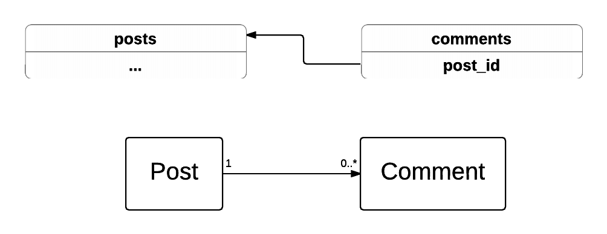
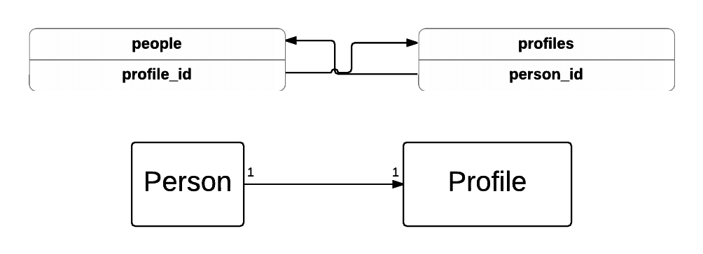
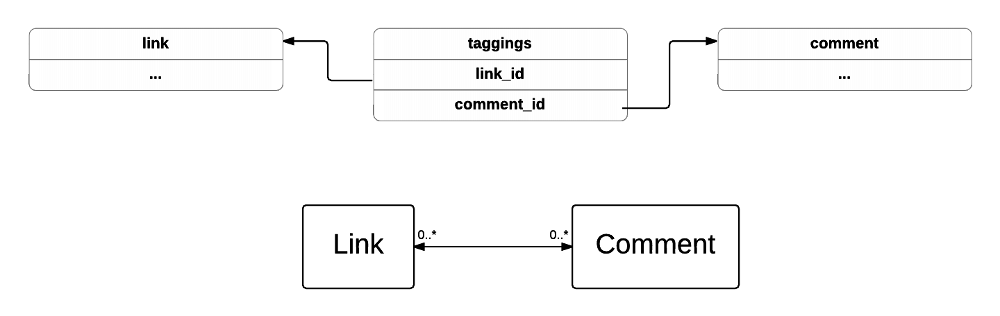
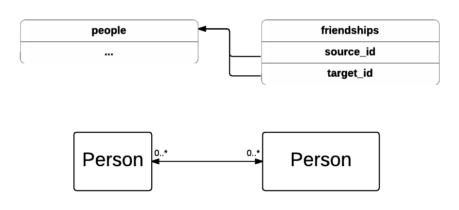

# Relationships between DB tables and Ruby

There are three main types of relationships between tables in the database:

- One to one
- One to many
- Many to many

## One to many



Here post has many comments. At the database level it means that `comments` table has a **foreign_key** column `post_id`. When we want to retrieve all comments for the first post using DataMapper we would write something like this:

```ruby
  Post.get(1).comments
```

it translates to an SQL query:

```sql
SELECT * FROM comments WHERE post_id = 1;
```
The model definitions will look like this:

```ruby
class Post
  has n :comments
  ...
end

class Comment
  belongs_to :post
  ...
end
```

Note the difference - at the DB level the `posts` table doesn't have any pointers to the `comments` table. However in the `Post` model we call the `has n` method. We do that to have access to the `comments` method.

## One-to-one



A one-to-one relationship is similar to one-to-many except now both tables have foreign keys pointing at each other.

```ruby
class Person
  include DataMapper::Resource

  has 1, :profile
end

class Profile
  include DataMapper::Resource

  belongs_to :person
end
```

There's no difference between `has 1` and `belongs_to` in the database, it's purely a DataMapper construct.

## Many to many


In this example an article can have many categories and a category can have many articles, so we need a many-to-many relationship. To implement that we introduce another table containing both `article_id` and `category_id`. Whenever we add a category to an article or vice versa we add a row to `article_categories` table with both article and category id.

```ruby
class Article
  has n, :categories, :through => Resource
  end

class Category
  has n, :article, :through => Resource
  end
end
```

Here we have a `:through => Resource` option passed to both `has n`s. The `:through` option tells DataMapper what table is used as a **join table**. `Resource` means that we use a conventional table named after both the tables it links to.

### Many to many `:through`

Sometimes the **join table** has an unconventional name. In that case we pass the table name to `:through`



```ruby
class Link
  has n, :tags, :through => :taggings
  end

class Tag
  has n, :links, :through => :taggings
end
```

### Many to many `:through` with `:via`



In this example a person can have many friends and also be a friend to many people. On the both sides of this relationship is the `people` table. The join table `friendships` contain two foreign keys - `source_id` and `target_id`. In the model we have to define the association with the join table name and the foreign key name.

```ruby
class Person
  has n, :friendships, :child_key => [ :source_id ]
  has n, :friends, self, :through => :friendships, :via => :target
end

class Friendship
  belongs_to :source, 'Person', :key => true
  belongs_to :target, 'Person', :key => true
end
```


