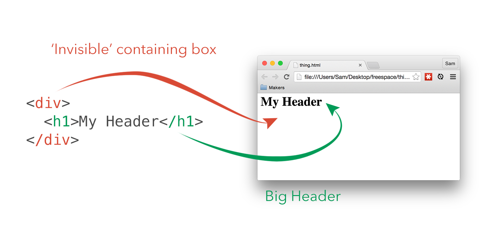
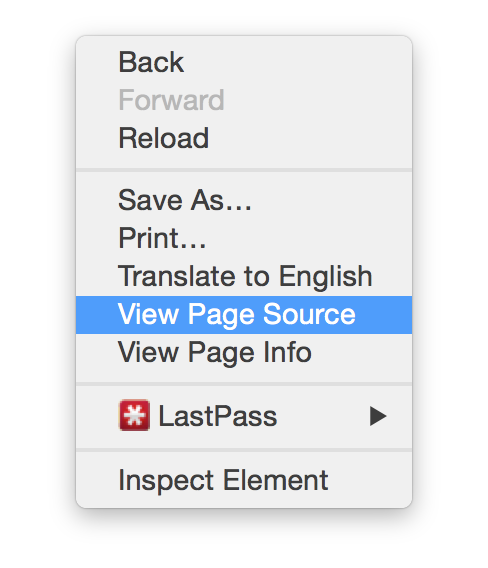
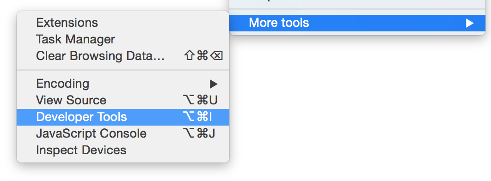
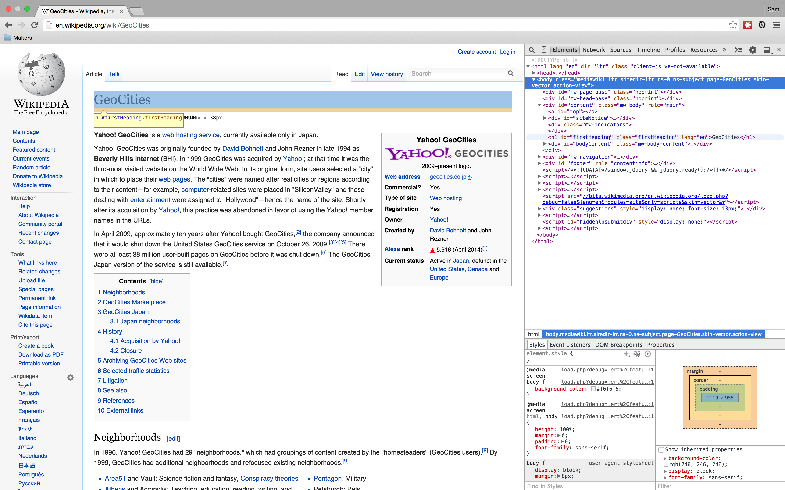

# HTML

**HyperText Markup Language** (HTML) is the foundation of the entire World Wide Web. It defines the **structure** of web pages through a series of _tags_. These tags are used to hold information.

This page is under construction. :construction:

## Getting Started

###### Semantic Structure and Tags

HTML should be used to define the structure of a web page semantically (i.e. according to meaning). [Cascading Style Sheets (CSS)](pills/css.md) should be used for _styling_ web pages (i.e. making them look pretty). As a result, HTML is a very logical and ordered language.

When an HTML file is received by a _browser_ (such as Google Chrome, Mozilla Firefox, Apple Safari, etc.) it is _rendered_ as a web page:



Above, we see two examples of HTML _tags_. One of them is `<div>` and the other is `<h1>`. Both of them have different _semantic meaning_:

- `<div>` is used as an all-purpose container, to separate content. Its use implies that there is content inside it.
- `<h1>` is the '1st-level header' tag. Its use implies that its contents constitute primary header for the page.

<aside>You should use more specific containers than `<div>` when creating HTML files, such as `<article>` and `<aside>`. These better convey the meaning of the contents than the general-purpose `<div>`. If you don't do this, your pages can end up being an inexplorable sea of `<div>` tags, which will make maintaining it harder - and search engines may penalise you, too.</aside>

You will note that both `<div>` and `<h1>` are repeated twice - as `</div>` and `</h1>`. This is because both of these tags are 'block' tags that require a **closing tag** to end their respective sections. Some tags, like `` (the _image_ tag, used to insert images within a page) are so-called 'self-closing' tags, and do not require, say, an `</img>` closing tag. It is generally good practice, though, to write self-closing tags with the `/` at the end anyway, like this: ``.

<aside>What happens if you don't close your opening block tags?</aside>

###### Attributes

```html

```

In the above line of code, `` is an HTML tag denoting an image, and `src` is an **HTML attribute**. It tells the browser something extra about the tag. [Here is a complete list of common HTML attributes](https://developer.mozilla.org/en-US/docs/Web/HTML/Attributes) - but since the arrival of [HTML5](pills/html5.md), you can now create your own custom attributes with the `data-` prefix. More on that later.

`src` tells us something about `` - specifically, the _source_ of its image. Likewise, in the following code:

```html
<a href="http://www.gumtree.com/cats/london/kittens+for+sale">Kittens for Sale</a>
```

`href` tells us something about `<a>` (the 'anchor' tag, used for hyperlinks) - specifically, where it will take us when we click on it. Note also that 'Kittens for Sale' is written directly within `<a>`. This is a perfectly normal thing to do: if tags contain any information (rather than more tags), it is _always_ text. This text _usually_ uses the [UTF-8 character set](http://en.wikipedia.org/wiki/UTF-8), and you will often have to specify for cases where it does not.

<aside>Can we use multiple attributes in HTML? What about something like `<a href="http://google.com" target="_blank">Click here</a>`? Is that valid HTML?</aside>

## Diving into HTML

Every webpage you've ever read through your browser has been built in HTML. It's not hidden, either: **right-click** and select **View source** from within a browser window to see the HTML:



But it gets even better! We can also inspect specific pages in detail. Modern browsers have a 'developer pane', which can be used to interact with the raw HTML structure of the page you're currently on. In Chrome, just head to the settings button (the 'hamburger' icon in the top right), scroll to 'More Tools', and select 'Developer Tools':



Once you have the developer pane open, you can hover over HTML 'elements' (represented by their tags) and your browser will _highlight the corresponding element on the page_! Cool, huh?



:construction:
