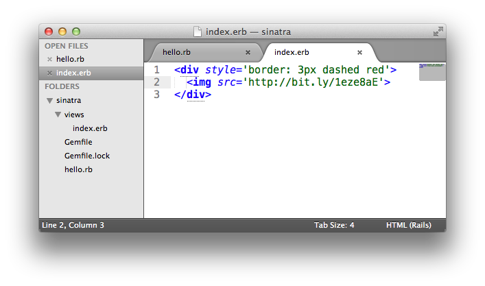
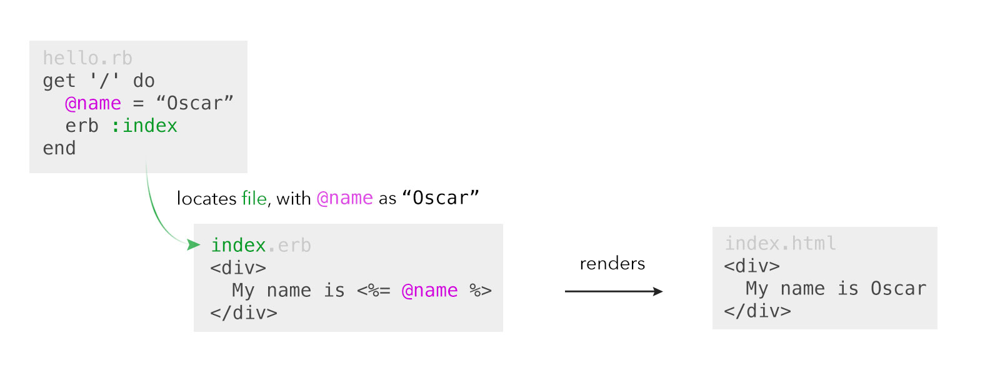

## ERB: Separating your Ruby from your HTML and CSS

So, we've got a kitten inside a box with a red border. The code looks like this

````ruby
require 'sinatra'

get '/' do
  "<div style='border: 3px dashed red'>
     
   </div>"
end
````

It works but you can already guess a problem: it doesn't scale. Web pages usually have hundreds, if not thousands lines of HTML and CSS code. That's on top of thousands of lines of Ruby code. Putting it all together in a single file would lead to a mess: lots of unstructured code that is very hard to maintain.

A better solution is to separate our Ruby and HTML code. Let's create a folder called **views**, located in the same directory as our _hello.rb_ file. Then create **views/index.erb**. Let's move the HTML code into the file we just created, so your project structure and the new file look like this:



In our _hello.rb_ file we'll just put this instead:

````ruby
require 'sinatra'

get '/' do
  erb :index
end
````

Assuming this all works it's a good time to commit our code, push it to Github and switch Driver/Navigator Roles again&nbsp;:twisted_rightwards_arrows:, but the question that's likely on your mind is what's happening here? On line 4 in the do ... end block, we're calling **erb**, a templating system that ships with Ruby. We are asking it to render a file called **index.erb** from the folder **views**. How does it know to look inside the folder **views**? The name of the folder is just a convention: if you don't specify any other name, erb will assume that you want to use the file in the **views** folder.

We just called **erb** a templating system. The reason is that it's actually much more powerful than it may seem on the surface. Erb stands for Embedded Ruby. This means that the templates can combine plain text, such as HTML code, with executable Ruby code.

Let's say we want to give our kitten a name. We aren't sure what the name actually is, so let's select it from an array of kitten names randomly.

````ruby
get '/' do
  @name = %w(Amigo Oscar Viking).sample
  erb :index
end
````

We've just selected a name for the kitten in the instance variable **@name**. Let's now display it on the web page. Update your HTML to look like this:

````html
<div style='border: 3px dashed red'>
  My name is <%= @name %>
  
</div>
````

The second line contains the text and an embedded ruby tag. The code that begins with <% and ends with %> is an _erb_ tag, it is not part of HTML. Everything inside this tag is executed as Ruby code. In this case, we're just getting the value of **@name** variable. Because there is an = sign after the opening tag, the value will be "printed" to the resulting HTML. After erb processes this template, the HTML code that your browser actually sees will look like this:

````html
<div style='border: 3px dashed red'>
  My name is Oscar
  
</div>
````

Technically, the **erb()** method reads the input file, processes Ruby that is inside and returns resulting HTML. This HTML is then returned by the block passed to the **get()** method:



So, we've just learned how to extract HTML into separate files and how to transfer data from Ruby code into templates. Naturally you'll want to commit the code, push it to Github and switch Driver/Navigator Roles &nbsp;:twisted_rightwards_arrows:.

Next up, let's use _parameters_ to add some more sophistication to our kitten website.

[Go to part 6](sinatra_6.md)

Resources
--------

* [Sinatra Main Site](http://www.sinatrarb.com/)
* [Sinatra Main Intro Documentation](http://www.sinatrarb.com/intro.html)
* [Talk Slides on Sinatra Chat Server](http://obfusk.org/achatwithsinatra/#1)
* [Detailed Talk Slides on Sinatra](http://www.slideshare.net/BobNadlerJr/sinatra-flatiron)
* [Sinatra Up and Running (Book)](http://shop.oreilly.com/product/0636920019664.do)
* [Jump Start Sinatra (Book)](http://www.sitepoint.com/store/jump-start-sinatra/)


