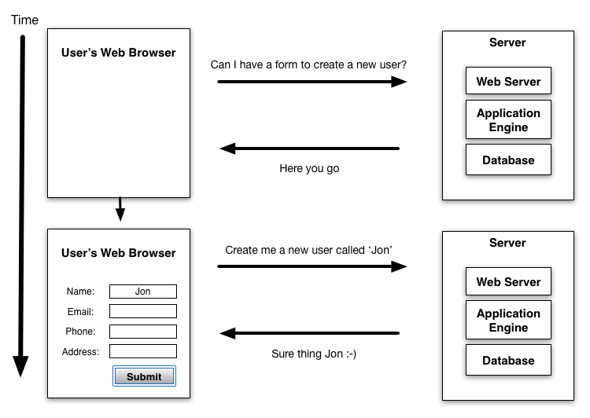
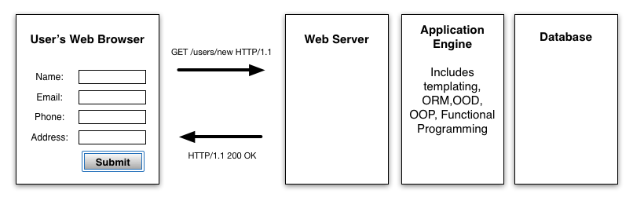
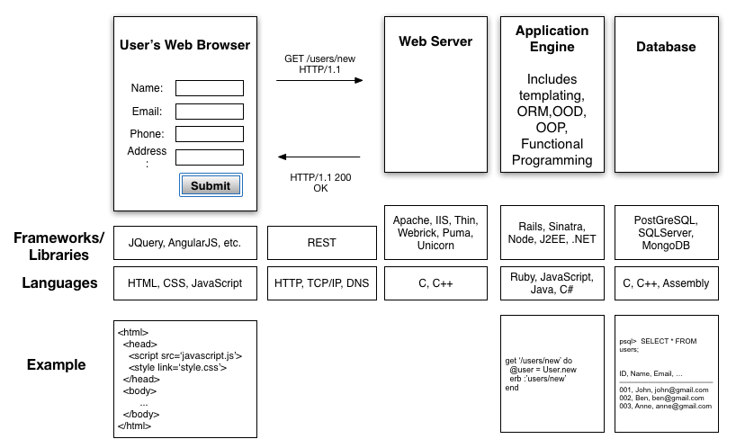

Three Tier Web Architecture
----------------

To be a successful web developer, you need to grasp this critical technical concept: Three Tier Web Architecture.

It's all about a process of communication between a user's web browser and a server.  A server is just another computer, but it's often a computer with a dedicated internet connection and lots of resources.  It will usually consist of a web server (to serve web pages), an application engine (to allow dynamic generation of those pages), and a database (to reliably store data related to those pages):

If we drill down a little we can see the *lingua franca* of the world-wide web: the HTTP protocol. This is the communication mechanism that allows the web to exist across multiple computers.  We can also see that the application engine is where web developers have to handle a lot of the complexity.  That is not to say that databases and web servers can't become very complex.  In fact they are very complex, but often they are just used "out of the box", and it's the application engine that takes up the most of a developers time in terms of creating new software.  It's the technologies relating to the application engine that will take up a good proportion of the time at Makers.

Drilling down even further we can see the names of the many technologies, languages, frameworks and protocols that are used at different levels in the three tier application stack, as well as examples of what some of these look like.  This diagram will largely seem like gobbledigook at the beginning of the course.  By the end of the course it will seem much clearer.  There will still be grey areas, but you will start to feel comfortable with knowledge of the different moving parts that allow you to create, and problem-shoot, large web applications.

Note, though, that there is far more complexity here than we can cover in 12 weeks.  To master it, you will need to become a self-directed learner. In particular, you'll need to use your agile process to drill down further into areas where you can acquire more knowledge.

The Three Tier Architecture is the Rosetta Stone of web development.  We want you to be great programmers and great project managers, and great team members, but critically we are focused on helping you become web developers. Understanding this architecture is key.
