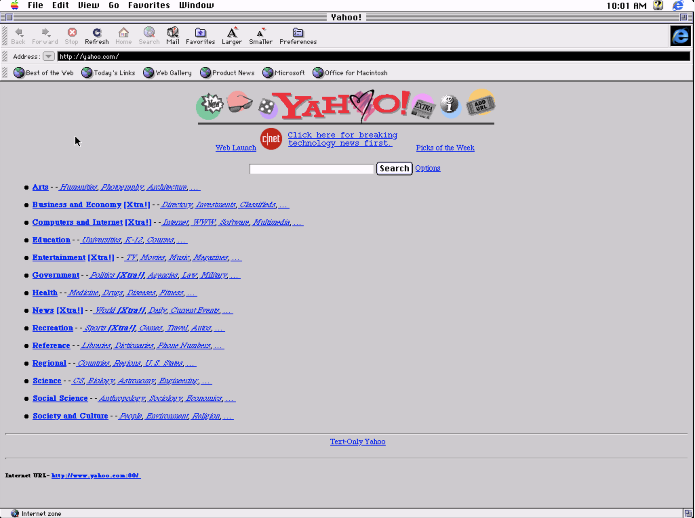

# 1: CSS for typography

Right at the beginning of the web, web pages were pretty much just text:

CSS was released in 1996, and ([according to The Internet Society memo](https://tools.ietf.org/html/rfc2318) that standardised it) it "aimed to describe the presentation of structured documents" using "common desktop publishing terminology".

In the couple of decades previous, desktop publishing was overwhelmingly concerned with digital typesetting. In fact, HTML derives from typesetting languages in the 70s. As a result, CSS followed suit: it cared most about type, fonts, colours: the written word.

> This is a useful thing to remember about CSS. It works like it works because it's principally designed to work with text. Even though it now works with loads of different things – boxes, animations, fluid interfaces – its roots are in typography.

## Exercise 1: typeset me

- Go to the [Motherfucking Website](http://motherfuckingwebsite.com/). Download it, and write a CSS file that uses the [26 Digital Typography Rules for Beginners](https://medium.com/product-design-ux-ui/26-digital-typography-rules-for-beginners-a04c6a5aaff3) to improve the type.

## Exercise 2: vertical rhythm

- Take your solution to Exercise 1, and use [4 Simple Steps to Vertical Rhythm](http://typecast.com/blog/4-simple-steps-to-vertical-rhythm) to establish a consistent vertical rhythm to the article.
