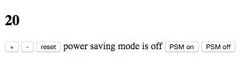
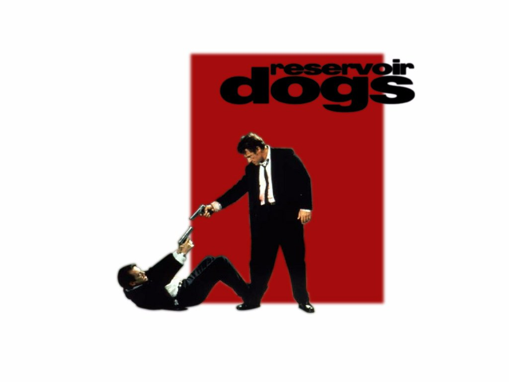
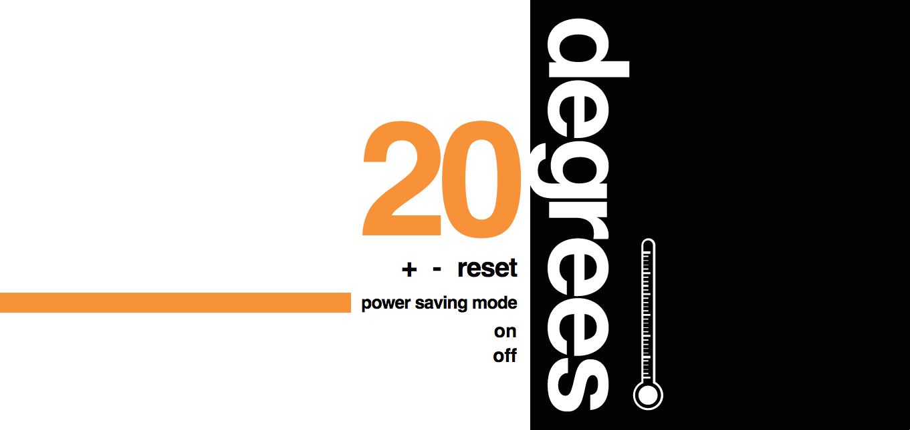

# Thermostat: styling

[Back to the Challenge Map](0_challenge_map.md)

While fully functional, it's rare to see a thermostat (or any app, really) in this sad state:

Instead, what we really want is something exploding with awesome, maybe even looking a bit like a Reservoir Dogs poster:

Or, influenced by whatever else you take your visual inspiration from.

### Learning Objectives covered

### To complete this challenge, you will need to:

- [ ] Style the thermostat

### Resources

- [Learn layout](http://learnlayout.com/)

### [Solution](solutions/9.md)
