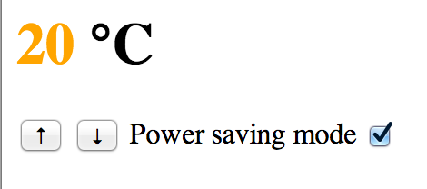

# JavaScript: Thermostat interface

This week we're looking at JavaScript, a very important language, since it is the only language that runs natively in client browsers.  It can also run on the server side, but as the de-facto client language it is hugely important.  Designed in 10 days in the 1990's by Brendan Eich since "if I didn't design it in less than 10 days, something much worse than JavaScript would have happened", JavaScript is a somewhat querky language that combines various elements from different existing languages, and has both great power and some dangerous pitfalls.

Do check out the [Learning Objectives for this week](learning_objectives.md)

To get started learning JavaScript please work through the [JavaScript & Jasmine Pill](../pills/javascript&JasminePill.md).

The project this week is to create a simple interface for a digital thermostat, using JavaScript, jQuery and Jasmine.  

Use the specifications below (hint: this could help you plan your Jasmine expectations).

## Stage 1
### Specifications

- Thermostat starts at 20 degrees
- You can increase the temp with the up button
- You can decrease the temp with the down button
- The minimum temperature is 10 degrees
- If power saving mode is on, the maximum temperature is 25 degrees
- If power saving mode is off, the maximum temperature is 32 degrees
- Power saving mode is on by default
- You can reset the temperature to 20 by hitting  the reset button
- The thermostat should color the display based on energy usage - < 18 is green, < 25 is yellow, otherwise red
- After every temperature change, the thermostat makes a POST request to localhost:4567/temperature_change, with the new temperature

## Stage 2

* Get the thermostat talking to a remote API to work out the temperature in order to decide whether to turn the heating on (hint, you can build your own server to provide a temperature API)

## Stage 3

* Style your thermostat using CSS.  Go to town and make it look beautiful!

## Stage 4

* Display the weather and temperature for cities around the world (http://weather-api.herokuapp.com/)

Resources
---------

* https://jquery.com/
* http://jasmine.github.io/
* https://github.com/velesin/jasmine-jquery
