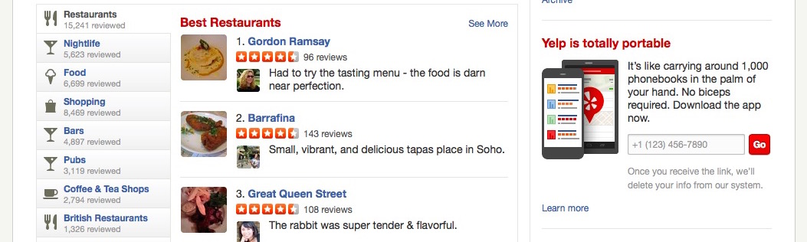

# Yelp

**Completion time - 1 week**

Rails is a popular web framework. Sinatra, by comparison, is a DSL, not a framework – it gives you much more flexibility and fewer conventions when you're building a website. Rails is, well... like being on rails. There are fewer decisions for you to make, and more decisions that are made for you. It's 'opinionated'.

This week's project is a clone of [Yelp](http://www.yelp.co.uk). The goal is to introduce you to Rails, focusing especially on:

* creating Rails applications
* the structure of Rails apps (MVC, the router, helpers)
* TDD in Rails, with RSpec & Capybara
* associations
* validations
* AJAX in Rails

**Contents**
- [Version 1 - MVP](#version-1---mvp)
    - [V1 Specification](#v1-specification)
    - [V1 Walkthrough](#v1-walkthrough)
- [Version 2 - User login](#version-2---user-login)
    - [V2 Specification](#v2-specification)
    - [V2 Walkthrough](#v2-walkthrough)
- [Version 3 - Enhanced UX](#version-3---enhanced-ux)
    - [V3 Specification](#v3-specification)
    - [V3 Walkthrough](#v3-walkthrough)
- [Resources](#resources)
- [Walkthroughs](#walkthroughs-under-construction)

## Version 1 - MVP

For the initial version we want to duplicate the core functionality of Yelp - users should be presented with a list of restaurants which they can leave reviews for.

Remember to drive the addition of all features using feature tests, and unit tests when needed.

### V1 Specification

- Visitors can create new restaurants using a form, specifying a name and cuisine
- Restaurants can be edited and deleted
- Visitors can leave reviews for restaurants, providing a numerical score (1-5) and a comment about their experience
- The restaurants listings page should display all the reviews, along with the average rating of each restaurant
- [Validations](https://github.com/makersacademy/Walkthroughs/blob/master/validations.md) should be in place for the restaurant and review forms - restaurants must be given a name and cuisine, reviews must be given a rating from 1-5 (comment is optional)

### [V1 Walkthrough →](yelpv1.md)

## Version 2 - User login

Although our initial version serves its purpose - it's limited in a few respects. First any visitor can freely delete or edit restaurants, leaving our site open to vandalism. Additionally, a user can leave multiple reviews for the same restaurant - making it easy for restaurant scores to be skewed.

We can solve both of these problems by adding a user login system, as we did with Bookmark Manager. This time though, we'll use a popular gem - [Devise](https://github.com/makersacademy/Walkthroughs/blob/master/devise.md) - to accelarate the implementation of our user system.

*A note on testing: We generally want to avoid testing code we haven't written, so we won't write exhaustive tests for the functionality Devise provides. However, user login/registration are important features whose functionality we need to ensure - so it's worth adding a few high-level feature tests to make sure users can register and sign in.*

*Any additional functionality regarding users that we add (e.g. users can only write one review per restaurant) should be tested as normal*.

### V2 Specification

* Users can register/login
* A user must be logged in to create restaurants
* Users can only edit/delete restaurants **which they've created**
* Users can only leave **one review per restaurant**
* Users can delete their own reviews
* Some indication should be given on the page (as part of the layout) whether the user is currently logged in, along with links to the available actions (i.e. Logout/Edit account is signed in, otherwise Sign In/Sign Up)
* The email address of the reviewer should be displayed as part of the review
* *Optional* - Users can't review a restaurant which they created

### [V2 Walkthrough →](yelpv2.md)

## Version 3 - Enhanced UX

Finally, let's focus on creating a better user experience. This will introduce us to [Rails helper methods] and [AJAX in Rails]. We'll also use CSS to enhance the look of our front-end.

### V3 Specification

* Currently, when writing a review, we have to go to a separate page and trigger a page refresh. Migrate the functionality to happen asynchronously with AJAX. We'll also have to set up [Poltergeist](https://github.com/teampoltergeist/poltergeist) to enable us to run JS-enabled tests.
* Create a helper method to allow ratings and average ratings to be displayed as stars (e.g.) rather than numbers
* Use CSS to enhance the overall design of the site
* Refactor your more complex views to use partials
* *Optional* - Add the ability for users to add an image to a restaurant, by pointing to an external image URL

### V3 Walkthrough →

## Resources

* [Getting Started with Rails](http://guides.rubyonrails.org/getting_started.html)
* [Structure of Rails apps (diagram)](http://images.thoughtbot.com/ember-rails-terminology-differences/rails.png)
* [ActiveRecord basics](http://guides.rubyonrails.org/active_record_basics.html)
* [Associations](http://guides.rubyonrails.org/association_basics.html)
* [Validations](http://guides.rubyonrails.org/active_record_validations.html)
* [Layouts and Rendering](http://guides.rubyonrails.org/layouts_and_rendering.html)
* [Michael Hartl's Rails tutorial](http://www.railstutorial.org/)

## Walkthroughs (under construction)

* :pill: [Rails console](pills/rails_console.md)
* :pill: [MVC](pills/mvc.md)
* [Rails](https://github.com/makersacademy/Walkthroughs/blob/master/rails.md) <-- Under construction
* [More Rails](https://github.com/makersacademy/Walkthroughs/blob/master/more_rails.md) <-- Under construction
* [Validations](https://github.com/makersacademy/Walkthroughs/blob/master/validations.md) <-- Under construction
* One-to-many
* [Helpers](https://github.com/makersacademy/Walkthroughs/blob/master/helpers.md)
* Ajax
* Devise
* JBuilder
* [Rails Create Update](https://github.com/makersacademy/Walkthroughs/blob/master/rails_create_update.md)  <-- Under construction
